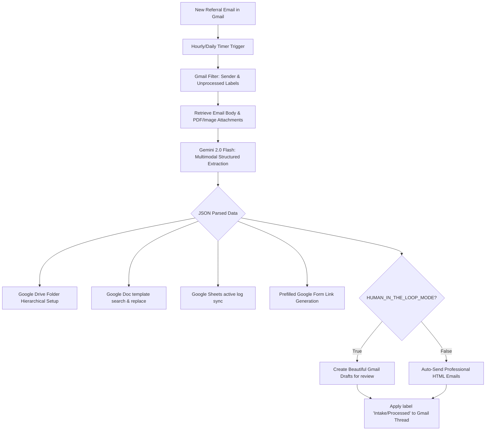

# Premium Patient Intake Workflow (Google Apps Script)

This is a state-of-the-art, production-grade automated patient intake system. 99% of your referrals from referring doctors are fully parsed, digitized, structured, and prepared in under 30 seconds.

---

## 🏛️ System Architecture



---

## 🛠️ Complete Installation & Setup Guide

Follow these 6 simple steps to deploy your clinic's upgraded patient intake hub.

### Step 1: Create Your Google Sheets Dashboard
1. Open [Google Sheets](https://sheets.google.com) and create a brand-new spreadsheet.
2. Name it **"Patient Intake Dashboard"**.
3. In the menu, click **Extensions** -> **Apps Script**.
4. In the Apps Script Editor:
   - Click the gear icon (**Project Settings**).
   - Check the checkbox **"Show appsscript.json manifest file in editor"**.
   - Return to the code editor.

---

### Step 2: Deploy the Apps Script Code Files
Create four files inside the Apps Script editor matching the filenames and copy-paste the corresponding code from your workspace:

1. **`appsscript.json`**: (Replace the default manifest contents).
2. **`Config.js`**: (Create a new script file and paste `Config.js`).
3. **`EmailTemplates.js`**: (Create a new script file and paste `EmailTemplates.js`).
4. **`Code.js`**: (Create a new script file and paste `Code.js`, replacing any template code).

Click the **Save** floppy-disk icon.

---

### Step 3: Initialize the Settings Hub
1. In the toolbar dropdown at the top of the Apps Script editor, select the function **`initializeSettingsSheet`**.
2. Click **Run**.
3. A popup will ask for permissions. Click **Review Permissions**, select your Google account, click **Advanced** -> **Go to Untitled Project (unsafe)**, and click **Allow**.
4. Go back to your Google Sheet! You will see a beautiful, custom-styled **"Settings"** tab pre-populated with keys and descriptions.

---

### Step 4: Configure Your Settings Values
Fill in the values in **Column B** of your newly created **Settings** tab:

| Setting Key | Value | Description |
| :--- | :--- | :--- |
| **`GEMINI_API_KEY`** | `AIzaSy...` | Get a free API Key in 30 seconds at [Google AI Studio](https://aistudio.google.com). |
| **`ROOT_DRIVE_FOLDER_ID`** | *Copy from URL* | Create a folder in Google Drive (e.g. "Patient Records"). Copy its ID from the URL (the letters/numbers after `folders/`). |
| **`PATIENT_INTAKE_TEMPLATE_ID`** | *Copy from URL* | Create a Google Doc for the "Patient Intake Form". Format it with placeholder tags (see below) and paste its ID. |
| **`FEE_TEMPLATE_ID`** | *Copy from URL* | Create a Google Doc for the "Fee Template". Format it with placeholder tags and paste its ID. |
| **`WORKERS_COMP_TEMPLATE_ID`** | *Copy from URL* | Create a Google Doc for the "Workers Comp Form". Format it with placeholder tags and paste its ID. |
| **`HEAD_INJURY_TEMPLATE_ID`** | *Copy from URL* | Create a Google Doc for the "Head Injury Report". Format it with placeholder tags and paste its ID. |
| **`PRE_VISIT_FORM_URL`** | `https://docs.google.com/.../viewform` | Your Google Form URL for patient intake. |
| **`HUMAN_IN_THE_LOOP_MODE`** | `true` | Set to `true` to save patient and attorney emails as drafts in Gmail for you to review before sending! |

---

### Step 5: Format Your Document Templates
Create your Google Doc templates with double-brace placeholder tags. The script will dynamically search and replace these values for each patient.

#### Recommended "New Injury Summary" Template Layout:
```markdown
                     NEW PATIENT CLINICAL INJURY SUMMARY
                     
Date Prepared: {{CurrentDate}}
Patient Name: {{PatientName}}                  DOB: {{DOB}}
Phone: {{Phone}}                              Email: {{Email}}
Referring Doctor: {{ReferringDoctor}}         Accident Date: {{AccidentDate}}
Legal Representative: {{AttorneyName}}

--------------------------------------------------------------------------------
1. PHYSICAL COMPLAINTS & INJURIES DOCUMENTED:
{{Injuries}}

2. CLINICAL RECONSTRUCTION (SUMMARY NARRATIVE):
{{ClinicalSummary}}
--------------------------------------------------------------------------------
```

#### Recommended "Head Injury Report" Template Layout:
```markdown
                       TRAUMATIC BRAIN INJURY & HEAD REPORT
                       
Patient Name: {{PatientName}}                  DOB: {{DOB}}
Referring Provider: {{ReferringDoctor}}         Report Date: {{CurrentDate}}

Clinical Presentation / Assessment:
{{ClinicalSummary}}
```

---

### Step 6: Test Instantly with a Mock Dry Run!
You don't need real referral emails in your inbox to test this! We built a dry-run simulator.
1. In the Apps Script toolbar dropdown, select the function **`runMockDryRun`**.
2. Click **Run**.
3. After the execution finishes, inspect:
   - Your **"Active Intake Queue"** Sheet tab. You will see a newly formatted row for a simulated patient named **"Jane Doe Mock"** complete with Drive folder links and document links!
   - Your **"Head Injury"** and **"WC Patients"** Sheet tabs! The script automatically detects that the mock patient has both head injury and work injury markers and routes them to both tabs! You will see the patient logged with a clickable folder link (e.g., `📁 Jane Doe Mock`), split first/last names, case type `WC`, and scheduling status `Not Seen`.
   - Your **Google Drive**. You will see a folder created for **"Jane Doe Mock"** containing a populated Injury Summary and Head Injury Report!
   - Your **Gmail Drafts Folder**. You will see beautifully designed welcome and coordination drafts ready to send!

---

## ⏰ Automating with Daily Schedule Triggers

Once everything is working, schedule the script to scan your inbox automatically:
1. In the Apps Script Editor, click the clock icon (**Triggers**) in the left sidebar.
2. Click **+ Add Trigger** in the bottom-right.
3. Configure the trigger settings:
   - **Choose which function to run**: `processNewPatientReferrals`
   - **Choose which deployment should run**: `Head`
   - **Select event source**: `Time-driven`
   - **Select type of time based trigger**: `Hour timer` (runs hourly) or `Day timer` (runs once daily)
4. Click **Save**.

Your clinic's new multi-agent administrative pipeline is now active and fully automated!

---

## 💡 Advanced Customization: Pre-filled Google Forms

To have the welcome email contain a link where the patient's **Name, Email, and Phone** are pre-filled:
1. Open your Google Form editor.
2. Click the three dots in the top right -> **Get pre-filled link**.
3. Type dummy text into your fields (e.g. `PATIENT_NAME`, `PATIENT_EMAIL`, `PATIENT_PHONE`).
4. Click **Get link** and copy it.
5. Notice the URL structure:
   `https://docs.google.com/forms/d/e/.../viewform?entry.10293=PATIENT_NAME&entry.94827=PATIENT_EMAIL`
6. Replace the parameter keys inside `Code.js` in the `generatePrefilledFormUrl()` function to match your form's exact `entry.xxxx` IDs!

---

## 📥 Referral-Capture Bot (`referral_bot.py`)

Reads recent Gmail, classifies each message with the existing `gpt_client`
(provider-agnostic — Gemini today, no new key), reconciles referral patients
against `upcoming_schedule.json`, and writes a pipeline state file. It runs in
**shadow mode by default**: it computes the acknowledgement reply and booking
task it *would* perform, but **sends and books nothing**.

- **Output (PHI, outside the repo):** `~/.gemini/antigravity/scratch/referral_state.json`
- **Run:** `python3 referral_bot.py --once`  (or `--watch 300` to poll every 300s)
- **Degrades gracefully:** with no Gmail credentials it still writes a valid
  state file with `gmail_connected: false` and a clear `last_error`, then exits 0.

### One-time Gmail connection

The mailbox `mainlinesurgery@gmail.com` is a **consumer** Gmail account, so a
service account cannot be used — the bot needs its own OAuth Desktop client.

1. Install deps (once): `python3 -m pip install google-api-python-client google-auth-oauthlib`
2. In Google Cloud Console: enable the **Gmail API**, add `mainlinesurgery@gmail.com`
   as an OAuth **Test user**, create an **OAuth client ID → Desktop app**, and
   download the client JSON to
   `~/.gemini/antigravity/scratch/gmail_oauth_client.json` (gitignored).
3. Run `python3 referral_bot_auth.py` → a browser opens; sign in and approve
   **read-only** Gmail access. The script saves the token to
   `~/.gemini/antigravity/scratch/gmail_token.json` and prints the
   `GMAIL_OAUTH_*` lines to paste into `.env`.
4. Verify: `python3 referral_bot.py --once` → `referral_state.json` should now
   show `gmail_connected: true`.

**Secrets:** all Gmail credentials live in `.env` and the scratch token/client
files (both gitignored). They are never committed and never printed in full.
Set `REFERRAL_BOT_MODE=live` only after the executor seam is built out — it is
intentionally OFF today.
